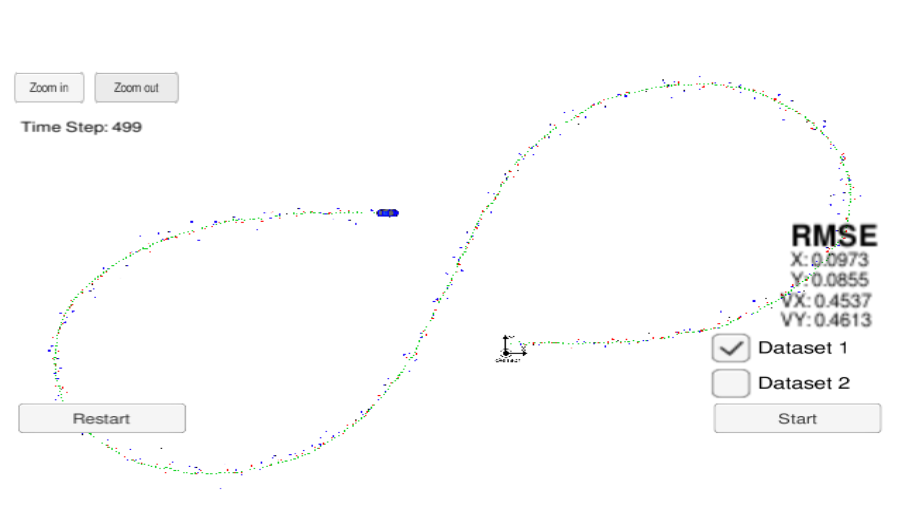
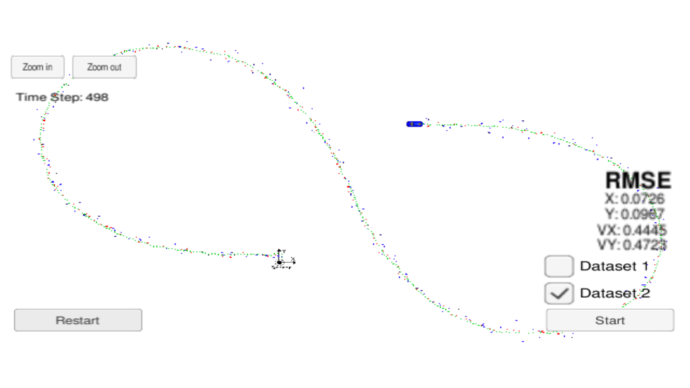
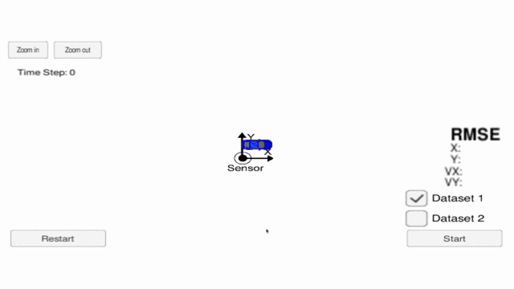
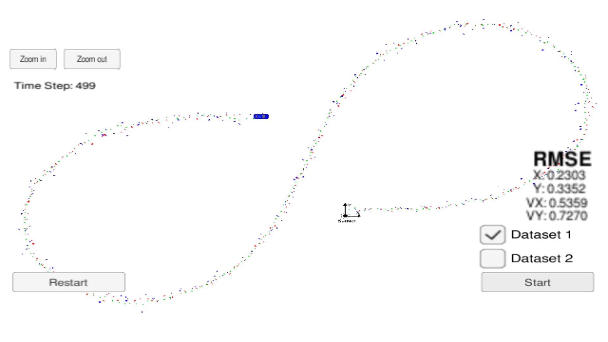
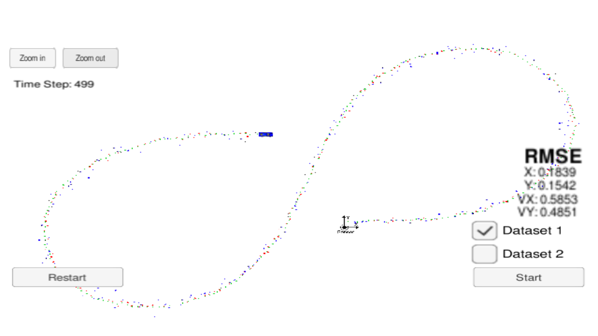

# Extended Kalman Filter Project Starter Code
In this project of the Self-Driving Car Engineer Nanodegree Program
an extended kalman filter needs to be implemented to estimate the position of a moving car.

The Project files and information about the required dependencies can be found [here](https://github.com/udacity/CarND-Extended-Kalman-Filter-Project).

This project involves the Term 2 Simulator which can be downloaded [here](https://github.com/udacity/self-driving-car-sim/releases).

Once the install for uWebSocketIO is complete, the main program can be built and run by doing the following from the project top directory.

1. mkdir build
2. cd build
3. cmake ..
4. make
5. ./ExtendedKF

The achived rmse for dataset 1 was :

* rmse_x = 0.0973
* rmse_y = 0.0855
* rmse_vx = 0.4537
* rmse_vy = 0.4613

Dataset 1 | Dataset 2
- | - 
 | 

The following animation shows that the filter successfully estimates the cars position even when turning.

Using one of the 2 sensors, the following **rmse** was achieved for Dataset 1.
Radar only | Lidar only
- | - 
 | 

**INPUT**: values provided by the simulator to the c++ program

["sensor_measurement"] => the measurement that the simulator observed (either lidar or radar)

**OUTPUT**: values provided by the c++ program to the simulator

["estimate_x"] <= kalman filter estimated position x

["estimate_y"] <= kalman filter estimated position y

["rmse_x"]

["rmse_y"]

["rmse_vx"]

["rmse_vy"]

---
